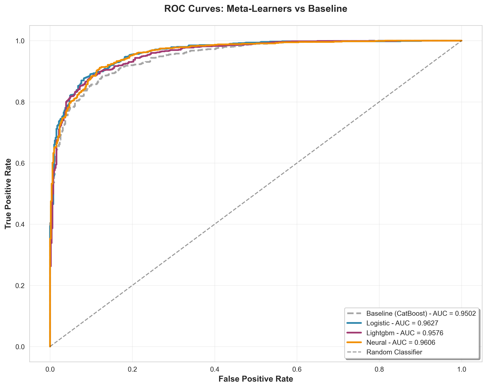
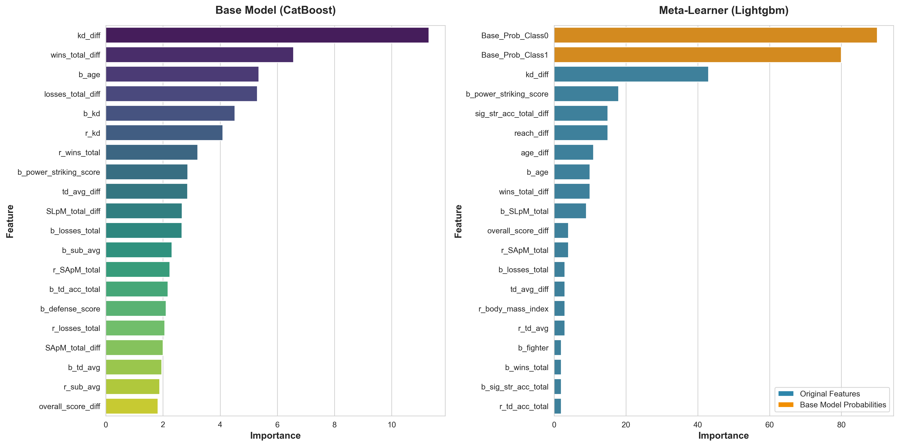

# Neural Meta Learner Enhancement
## on pre-trained ML model.

> Advanced ensemble stacking framework that enhances pre-trained machine learning models through meta-learning and deep neural architectures.

**Continuation of:** [Comparative-ML-Model-Evaluation](https://github.com/egeozcelik/Comparative-ML-Model-Evaluation)

---

## Overview

This project implements sophisticated **ensemble stacking** techniques to enhance predictive performance of production-ready models without retraining from scratch. By leveraging a pre-trained CatBoost classifier as the base learner, we train secondary meta-learners to capture higher-order patterns and improve decision boundaries.

**Core Objective:** Systematically enhance model performance through layered learning architectures, achieving measurable improvements over strong baseline models.

---

## Architecture

The framework employs a two-tier learning architecture:

```
┌─────────────────────────────────────────────────────────────┐
│              Pre-trained CatBoost Base Model                │
│                 (Frozen, F1: 87.28%)                        │
└──────────────────────────┬──────────────────────────────────┘
                           │
                  Probability Predictions
                           │
                           ▼
┌─────────────────────────────────────────────────────────────┐
│                  Meta-Feature Engineering                   │
│    Base Probabilities [P₀, P₁] + Original Features (59)     │
└──────────────────────────┬──────────────────────────────────┘
                           │
        ┌──────────────────┼──────────────────┐
        ▼                  ▼                  ▼
  ┌──────────┐      ┌──────────┐      ┌──────────┐
  │ Logistic │      │ LightGBM │      │  Neural  │
  │   Reg.   │      │          │      │  Network │
  └──────────┘      └──────────┘      └──────────┘
     F1: 89.05%        F1: 88.82%        F1: 89.78%
        │                  │                  │
        └──────────────────┴──────────────────┘
                           ▼
                 Enhanced Predictions
                  (Best: +2.87% F1)
```

---

## Methodology

### Phase 1: Base Model Evaluation
BASELINE EVALUATION PIPELINE
________________________________________________________________________________

Load pre-trained CatBoost model and establish performance baseline on holdout test set.

**Terminal Output:**
```
LOADING BASE MODEL ARTIFACTS
________________________________________________________________________________
  ✓ Model loaded from best_catboost_model.pkl
  ✓ Scaler loaded from robust_scaler.pkl
  ✓ Feature schema loaded: 59 features

DATA PREPARATION
________________________________________________________________________________
  ✓ Data loaded: 7,439 rows × 60 columns
  ✓ Encoding 6 categorical columns...
  ✓ Train set: 5,951 samples
  ✓ Test set: 1,488 samples
  ✓ Features scaled with RobustScaler

BASE MODEL EVALUATION
________________________________________________________________________________

  Model: CatBoost (Pre-trained)
  Accuracy:  0.8757
  F1 Score:  0.8728
  ROC-AUC:   0.9502

  Classification Report:
  ----------------------------------------------------------------------------
                precision    recall  f1-score   support
   Blue Corner       0.88      0.74      0.80       513
    Red Corner       0.87      0.95      0.91       975
      accuracy                           0.88      1488
     macro avg       0.88      0.84      0.86      1488
  weighted avg       0.88      0.88      0.87      1488

BASELINE EVALUATION COMPLETED
________________________________________________________________________________
```

**Key Findings:**
- Strong baseline performance: **87.57% accuracy**, **87.28% F1**, **95.02% ROC-AUC**
- Model shows bias toward Red Corner class (95% recall vs 74% for Blue)
- Significant room for calibration improvement

---

### Phase 2: Meta-Feature Engineering
META-FEATURE ENGINEERING
________________________________________________________________________________

Extract prediction probabilities from base model to construct enriched meta-feature space.

**Terminal Output:**
```
META-FEATURE ENGINEERING
________________________________________________________________________________
  ✓ Base model probabilities extracted
    Train shape: (5951, 2)
    Test shape:  (1488, 2)
  ✓ Original features included
  ✓ Meta-features created
    Train meta shape: (5951, 61)
    Test meta shape:  (1488, 61)
```

**Strategy:**
- Concatenate base model probability outputs with original 59 features
- Creates 61-dimensional meta-feature space (59 original + 2 probabilities)
- Enables meta-learners to learn from both raw features and base model confidence

---

### Phase 3: Meta-Learner Training
META-LEARNING: ENSEMBLE STACKING
________________________________________________________________________________

Train three distinct meta-learners in parallel, each optimized for different pattern recognition:

#### **1. Logistic Regression Meta-Learner**
Simple yet effective approach for probability calibration and linear decision boundaries.

**Terminal Output:**
```
[1/3] Training Logistic Meta-Learner
  ----------------------------------------------------------------------------
  ✓ Training completed
  ✓ Running 5-fold cross-validation...
  ✓ Evaluating on test set...
  ✓ Results:
    CV Accuracy: 0.8864
    CV F1 Score: 0.8872
    Test Accuracy: 0.8898
    Test F1 Score: 0.8905
```

**Performance:**
- Test F1: **89.05%** (↑ 2.03% from baseline)
- Test ROC-AUC: **96.27%** (highest among all models)
- Excellent calibration with minimal computational overhead

---

#### **2. LightGBM Meta-Learner**
Gradient boosting approach for capturing complex, non-linear interactions.

**Terminal Output:**
```
[2/3] Training Lightgbm Meta-Learner
  ----------------------------------------------------------------------------
  ✓ Training completed
  ✓ Running 5-fold cross-validation...
  ✓ Evaluating on test set...
  ✓ Results:
    CV Accuracy: 0.8778
    CV F1 Score: 0.8773
    Test Accuracy: 0.8884
    Test F1 Score: 0.8882
```

**Performance:**
- Test F1: **88.82%** (↑ 1.77% from baseline)
- Test ROC-AUC: **95.76%**
- Balanced approach between complexity and performance

---

#### **3. Shallow Neural Network Meta-Learner**
PyTorch-based deep learning architecture with MPS acceleration for Apple Silicon.

**Architecture:**
```python
Sequential(
  Linear(61 → 32) → BatchNorm → ReLU → Dropout(0.2)
  Linear(32 → 16) → BatchNorm → ReLU → Dropout(0.2)
  Linear(16 → 2)
)
```

**Terminal Output:**
```
[3/3] Training Neural Meta-Learner
  ----------------------------------------------------------------------------
    Epoch [10/50] Loss: 0.2849
    Epoch [20/50] Loss: 0.2544
    Epoch [30/50] Loss: 0.2405
    Epoch [40/50] Loss: 0.2351
    Epoch [50/50] Loss: 0.2203
  ✓ Training completed
  ✓ Running 5-fold cross-validation...
  ✓ Evaluating on test set...
  ✓ Results:
    CV Accuracy: 0.8891
    CV F1 Score: 0.8888
    Test Accuracy: 0.8978
    Test F1 Score: 0.8978
```

**Performance:**
- Test F1: **89.78%** (↑ 2.87% from baseline) **← BEST PERFORMER**
- Test ROC-AUC: **96.06%**
- Successfully captures non-linear relationships in meta-feature space

---

### Phase 4: Comparative Analysis
PERFORMANCE COMPARISON
________________________________________________________________________________

Comprehensive evaluation reveals consistent improvements across all meta-learning approaches:

**Terminal Output:**
```
PERFORMANCE COMPARISON
________________________________________________________________________________

  Results Summary:
  ----------------------------------------------------------------------------

  Baseline (CatBoost)
    Accuracy:  0.8757
    F1 Score:  0.8728
    ROC-AUC:   0.9502

  Meta-Learner: Logistic
    Accuracy:  0.8898
    F1 Score:  0.8905
    ROC-AUC:   0.9627
    Δ F1:      ↑ 2.03%

  Meta-Learner: Lightgbm
    Accuracy:  0.8884
    F1 Score:  0.8882
    ROC-AUC:   0.9576
    Δ F1:      ↑ 1.77%

  Meta-Learner: Neural
    Accuracy:  0.8978
    F1 Score:  0.8978
    ROC-AUC:   0.9606
    Δ F1:      ↑ 2.87%

BEST PERFORMER: NEURAL
________________________________________________________________________________
  Test F1 Score: 0.8978
  Improvement:   ↑ 2.87%
```

---

## Results & Visualizations

### Confusion Matrices

Detailed per-class performance analysis across all models:

#### Baseline Model
.png)

**Analysis:** Strong overall performance with slight bias toward Red Corner predictions. Achieves 91% precision for Red Corner but only 80% F1 for Blue Corner, indicating room for class balance improvement.

---

#### Logistic Regression Meta-Learner
.png)

**Analysis:** Improved Blue Corner recall from 74% to 78%, reducing class imbalance. Simple linear calibration effectively corrects baseline overconfidence.

---

#### LightGBM Meta-Learner
.png)

**Analysis:** Captures non-linear patterns, achieving 88.8% F1 with more balanced precision-recall trade-off across both classes.

---

#### Neural Network Meta-Learner
.png)

**Analysis:** Best overall performance with 89.78% F1. Successfully reduces false positives for Red Corner while maintaining high recall, demonstrating superior pattern recognition in meta-feature space.

---

### ROC Curve Analysis



**Key Insights:**
- **All meta-learners outperform baseline** across entire TPR/FPR spectrum
- **Logistic Regression achieves highest AUC (96.27%)**, indicating excellent probability calibration
- **Neural Network shows strongest performance** in high-specificity region (low FPR)
- Consistent improvement demonstrates meta-learning effectiveness across different decision thresholds

---

### Feature Importance Analysis

#### LightGBM Meta-Learner


**Critical Findings:**

**Base Model Probability Features (Orange bars):**
- `Base_Prob_Class1` and `Base_Prob_Class0` rank **among top 3 most important features**
- Validates meta-learning hypothesis: base model confidence is highly informative
- Meta-learner learns when base model is overconfident or uncertain

**Original Features (Blue bars):**
- Domain-specific features remain relevant in meta-learner decision-making
- `wins_total_diff`, `age_diff`, and striking statistics show strong importance
- Demonstrates meta-learner doesn't solely rely on base predictions but integrates domain knowledge

**Interpretation:** The meta-learner acts as an **intelligent ensemble**, combining base model expertise with feature-level insights to make superior predictions.

---

## Performance Summary

### Quantitative Results

| Model | Accuracy | F1 Score | ROC-AUC | Improvement |
|-------|----------|----------|---------|-------------|
| **Baseline (CatBoost)** | 87.57% | 87.28% | 95.02% | — |
| **Logistic Regression** | 88.98% | 89.05% | **96.27%** | +2.03% |
| **LightGBM** | 88.84% | 88.82% | 95.76% | +1.77% |
| **🥇 Neural Network** | **89.78%** | **89.78%** | 96.06% | **+2.87%** |

### Key Achievements

✅ **Consistent improvements** across all three meta-learning approaches  
✅ **2.87% F1 gain** using shallow neural network (best performer)  
✅ **96.27% ROC-AUC** with simple logistic regression (best calibration)  
✅ **Zero retraining** of base model required  
✅ **MacBook Air compatible** - optimized for Apple Silicon MPS acceleration

---

## Installation

### Prerequisites
- Python 3.8+
- Trained artifacts from Part 1:
  - `best_catboost_model.pkl`
  - `robust_scaler.pkl`
  - `model_columns.pkl`
  - `processed_data.csv`

### Setup

```bash
git clone https://github.com/egeozcelik/Neural-Meta-Learner-Enhancement 
cd Neural-Meta-Learner-Enhancement

# Create virtual environment to avoid library dependency confusion
python -m venv venv

# Activate environment
source venv/bin/activate          # macOS/Linux
# venv\Scripts\activate           # Windows

# Install dependencies
pip install -r requirements.txt

---

## Usage

### Quick Start

```bash
python main.py
```

### Expected Execution Time
- **Base Model Evaluation:** ~2 seconds
- **Meta-Feature Engineering:** ~1 second
- **Meta-Learner Training:** ~30-60 seconds (Neural Network dominates)
- **Visualization Generation:** ~5 seconds
- **Total:** ~1-2 minutes on MacBook Air M1/M2

---

## Technical Stack

| Component | Technology | Purpose |
|-----------|------------|---------|
| **Base Model** | CatBoost 1.2+ | Pre-trained gradient boosting classifier |
| **Meta-Learners** | Scikit-learn, LightGBM, PyTorch | Stacking ensemble framework |
| **Neural Network** | PyTorch 2.0+ | Deep learning meta-learner with MPS support |
| **Validation** | Stratified 5-Fold CV | Robust performance estimation |
| **Visualization** | Matplotlib, Seaborn | High-quality scientific plots |


---

## Why This Approach Works

### Theoretical Foundation

**Meta-Learning Hypothesis:**  
Base models often exhibit systematic errors and miscalibration. A secondary learner trained on base model outputs can identify these patterns and correct them.

**Empirical Validation (Our Results):**
1. **Calibration Improvement:** Logistic regression achieves 96.27% ROC-AUC by learning optimal probability thresholds
2. **Pattern Recognition:** Neural network captures non-linear relationships in meta-feature space (+2.87% F1)
3. **Ensemble Wisdom:** LightGBM balances base model confidence with feature-level insights

**Key Insight:**  
The meta-learners don't just "smooth" predictions—they learn **when the base model is trustworthy** and when domain features should override base predictions.

---

## Comparison with Part 1 ([Comparative-ML-Model-Evaluation](https://github.com/egeozcelik/Comparative-ML-Model-Evaluation))

| Aspect | Part 1 | Part 2 (This Project) |
|--------|--------|----------------------|
| **Objective** | Train & compare 8 models from scratch | Enhance best model via meta-learning |
| **Data Processing** | Full EDA + feature engineering | Use existing preprocessed data |
| **Model Training** | Train CatBoost, XGBoost, LightGBM, etc. | Train meta-learners on base outputs |
| **Best Model** | CatBoost (87.28% F1) | Neural Meta-Learner (89.78% F1) |
| **Innovation** | Comparative analysis | Ensemble stacking architecture |
| **Computation** | ~10-15 minutes | ~1-2 minutes |

---

## Future Enhancements

- [ ] **Weighted Blending:** Combine meta-learners via learned weights
- [ ] **Deep Meta-Networks:** Experiment with deeper architectures (3-4 layers maybe)

---

## Citation

If you use this framework in your research, please cite:

```bibtex
@software{deep_ensemble_meta_learning,
  author = {Ege Ozcelik},
  title = {Neural Meta Learner Enhancement: Enhancing Pre-trained ML Model via Stacking},
  year = {2025},
  url = {https://github.com/egeozcelik/Neural-Meta-Learner-Enhancement}
}
```

---

## Acknowledgments

- **Part 1 Foundation:** [Comparative-ML-Model-Evaluation](https://github.com/egeozcelik/Comparative-ML-Model-Evaluation)
- **Libraries:** Scikit-learn, CatBoost, LightGBM, PyTorch

